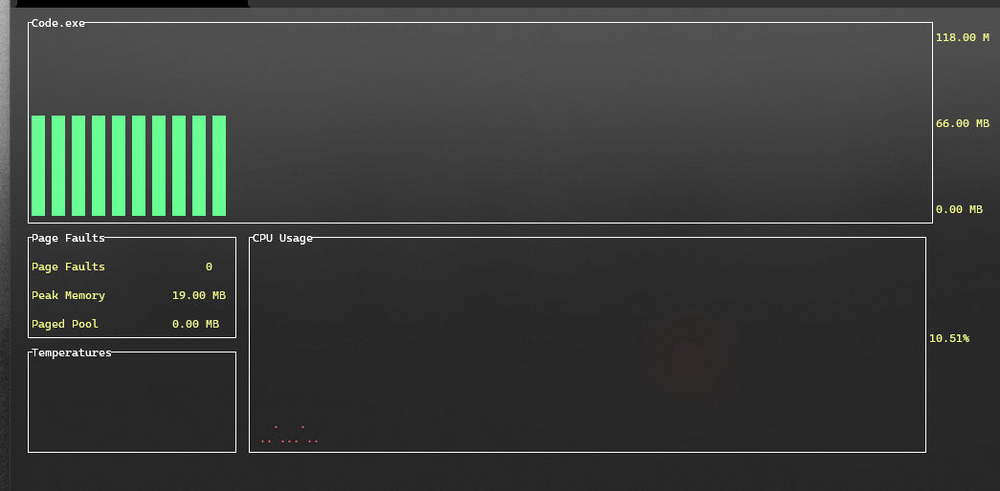
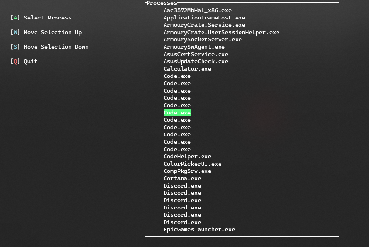

# Performance Analyzer

A Lightweight terminal application for analysing the memory and CPU usage of a target application. Implimented using the Windows Console Library for output rendering.

Designed as a standalone version of the debug memory output in Visual Studio.

## UI

# Installation

Uses Version 1.0 of [CConsoleLib](https://github.com/Tom-Sheiles/CConsoleLib). A Header only library designed as a wrapper for the windows console API.

Must be compiled with the MSVC compiler and as such is only compatible with the Windows operating system.

# Usage

The binary is named `perfan` 

Running the program with no arguments will list all currently running processes for the application to attach to.

 If the direct path to another applications binary is provided, the selected program will automatically launched and will be used as the attach point.